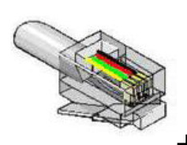

# DSMR P1 MQTT bridge (ESP8266) #

## Purpose ##

Connect to the dsmr's P1 port (Dutch slimme meter) using wifi: no
special cables nor dedicated hardware!

Tested with a Sagemcom T210-D and Adafruit HUZZAH module. This setup
turned out to be very reliable.

## Implementation ##

Using a ESP8266, read DSMR telegrams from the P1 port and publish them
using MQTT. In contrast to most other implementations which read the
P1 port, no hardware inverter is required. By properly configuring the
UART's receive pin, the input is inverted and can be used directly.

The implementation was tested using a Adafruit HUZZAH ESP8266 board,
powered using an old mobile phone charger, connected to a Sagemcom
T210-D metering device with the UART RX pin connected to the P1's
Data (pin #5), GND to Data GND (pin #3) and GPIO 04 connected to Data
Request (pin #2). One can simply use an old fully wired (all four
connections) RJ11 telephone wire for this.



GPIO pin 4 is used to
enable/disable sending by the P1 port by taking the Data Request line
HIGH/LOW.  The Sagemcom T210-D uses protocol DSMR P1 version 5.0. With
a properly wired RJ12 connector, one probably can even power the board
from the P1 port as well and omit the external power supply.

The sketch implements two equivalant CRC checking functions, one using
a lookup table and another one which processes the message
bit-by-bit. The one using the lookup table might be faster at the cost
of more memory being used, but this was not tested.

Over-the-air (OTA) programming is also implemented.

The [PubSubClient](https://pubsubclient.knolleary.net/) Arduino Client
for MQTT is used. It is assumed a user name and password are required
to connect to the broker or remove the credentials from the
`pubsubClient.connect()` call otherwise. In the `dsmr-mqtt-basic.ino`
sketch, the telegram is published using topic `dsmr`.

### Parsing ###

In sketch `dsmr-mqtt.ino` the telegram is parsed using the
[`arduino-dsmr`
parser](https://github.com/matthijskooijman/arduino-dsmr) and the
parsed fields are published using seperate topics. To change which
fields to parse, change the code reading:

```
using DSMRData = ParsedData<
//  /* String */ identification,
  ...
  /* FixedValue */ energy_delivered_tariff1,
  /* FixedValue */ energy_delivered_tariff2,
 ...
  /* String */ electricity_tariff,
  /* FixedValue */ power_delivered,
  ...
  /* uint32_t */ electricity_failures,
  /* uint32_t */ electricity_long_failures,
  ...
>;
```

Uncomment the fields you want to use or vice versa and add / remove
the call to publish the fields in function `void publish(DSMRData
data)`.

```
void publish(DSMRData data) {

  char buf[128];
  
  /* FixedValue */
  pubsubClient.publish("dsmr/energy_delivered_tariff1", itoa(data.energy_delivered_tariff1.int_val(), buf, 10));
  ...
  /* String */
  pubsubClient.publish("dsmr/electricity_tariff", data.electricity_tariff.c_str());
  ...
  /* uint32_t */
  pubsubClient.publish("dsmr/electricity_failures", itoa(data.electricity_failures, buf, 10));
  ...
}
```
The [`arduino-dsmr` parser](https://github.com/matthijskooijman/arduino-dsmr) takes care of reading from the P1 port and checking CRCs. The trick 
here is again to invert the UART's Rx input during setup.

## Configuration ##

I use the file `credentials.h` for the user names and passwords used
in the script and exclude this file from git to keep stuff save. You
can do the same or just edit the sketch and add the credentials:

 * `STASSID` is your wifi's SSID
 * `STAPSK` the pre-shared wifi key (wifi password)
 * `MQTT_USER`
 * and `MQTT_PASSWD`

Also, edit the sketch for the MQTT brokers name or IP address and the
server's certificate fingerprint (`MQTT_SERVER` and `MQTT_FP`).

## Using TLS ##

According to the
[documentation](https://arduino-esp8266.readthedocs.io/en/latest/esp8266wifi/bearssl-client-secure-class.html#cpu-requirements),
one should run the ESP8266 at 160 MHz. Switch the CPU frequency from
the default 80 MHz to 160 MHz from the Tools menu in the Arduino
IDE. However, everything works just fine with 80 MHz which should make
the board consume less power.

To verify the connection, the fingerprint of the server's certificate
is used as described
[here](https://arduino-esp8266.readthedocs.io/en/latest/esp8266wifi/bearssl-client-secure-class.html#setfingerprint-const-uint8-t-fp-20-setfingerprint-const-char-fpstr),
or use
[`setInsecure()`](https://arduino-esp8266.readthedocs.io/en/latest/esp8266wifi/bearssl-client-secure-class.html#setinsecure)
in case you just want a TLS connecting without verifying you're
talking to the correct server.

To calculate the fingerprint `MQTT_FP`, use the command:
```
$ openssl x509 -in <mqtt-server.crt> -noout -fingerprint
SHA1 Fingerprint=F7:XX:XX:XX:XX:XX:XX:XX:XX:XX:XX:XX:XX:XX:XX:XX:XX:XX:XX:31
```

In case you don't want to use TLS, change `WiFiClientSecure
wifiClient` into `WiFiClient wifiClient` and remove the
`wifiClient.setFingerprint(fingerprint)` call in the function
`setup()`. Also change the `MQTT_PORT` to `1883` instead of `8883`.

### Home Assistant ###

If the mosquitto mqtt broker
[add-on](https://github.com/home-assistant/hassio-addons/blob/master/mosquitto/DOCS.md)
is used on Home Assistant, put the crt and key files in the ssl
directory. Change the mosquitto configuration to:

```
logins: []
anonymous: false
customize:
  active: false
  folder: mosquitto
certfile: <server>.crt
keyfile: <server>.key
require_certificate: false
```

## Links ##

 * [Adafruit HUZZAH ESP8266](https://learn.adafruit.com/adafruit-huzzah-esp8266-breakout/overview)
 * [Arduino core for ESP8266 WiFi chip](https://github.com/esp8266/Arduino#arduino-core-for-esp8266-wifi-chip)
 * [ESP8266 Arduino Core’s documentation](https://arduino-esp8266.readthedocs.io/en/latest/index.html)
 * [PubSubClient](https://pubsubclient.knolleary.net/)
 * [Slimme meter on wikipedia](https://nl.wikipedia.org/wiki/Slimme_meter)
 * [P1 Companion Standard](https://www.netbeheernederland.nl/_upload/Files/Slimme_meter_15_a727fce1f1.pdf)
 * [How to Install and Secure the Mosquitto MQTT Messaging Broker on Debian 9](https://www.digitalocean.com/community/tutorials/how-to-install-and-secure-the-mosquitto-mqtt-messaging-broker-on-debian-9)
* [The BearSSL WiFi Classes](https://arduino-esp8266.readthedocs.io/en/latest/esp8266wifi/bearssl-client-secure-class.html)
* [bearssl-esp8266 on github](https://github.com/earlephilhower/bearssl-esp8266)
* [Examples of using WiFiClientSecure](https://github.com/esp8266/Arduino/tree/master/libraries/ESP8266WiFi/examples)
* [Home Assistant Add-on: Mosquitto broker](https://github.com/home-assistant/hassio-addons/tree/master/mosquitto)
* [`arduino-dsmr` parser](https://github.com/matthijskooijman/arduino-dsmr)
